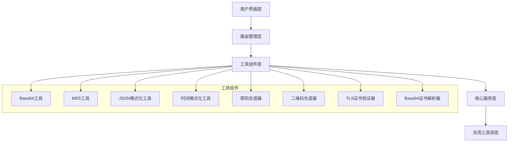

# 设计文档

## 概述

实用工具管理系统是一个基于静态网页的单页应用程序（SPA），提供8个独立的实用工具。该系统采用模块化架构，每个工具都是独立的组件，通过路由系统实现唯一URL访问。系统使用纯前端技术栈，无需后端服务器，可部署到任何静态网站托管服务。

## 架构

### 整体架构



### 技术栈

- **前端框架**: Vue.js 3 (Composition API)
- **路由**: Vue Router 4
- **UI框架**: Element Plus (响应式设计)
- **构建工具**: Vite
- **样式**: CSS3 + Flexbox/Grid
- **JavaScript库**:
  - CryptoJS (MD5加密)
  - QRCode.js (二维码生成)
  - node-forge (TLS证书解析)

## 组件和接口

### 核心组件结构

```
src/
├── components/
│   ├── layout/
│   │   ├── AppHeader.vue
│   │   ├── AppNavigation.vue
│   │   └── AppFooter.vue
│   └── tools/
│       ├── Base64Tool.vue
│       ├── MD5Tool.vue
│       ├── JsonFormatter.vue
│       ├── TimeFormatter.vue
│       ├── PasswordGenerator.vue
│       ├── QRCodeGenerator.vue
│       ├── TLSValidator.vue
│       └── Base64CertParser.vue
├── services/
│   ├── cryptoService.js
│   ├── timeService.js
│   ├── qrService.js
│   └── certService.js
├── utils/
│   ├── validators.js
│   └── formatters.js
├── router/
│   └── index.js
├── styles/
│   ├── main.css
│   └── responsive.css
└── App.vue
```

### 路由设计

```javascript
const routes = [
  { path: '/', redirect: '/base64' },
  { path: '/base64', component: Base64Tool, name: 'base64' },
  { path: '/md5', component: MD5Tool, name: 'md5' },
  { path: '/json', component: JsonFormatter, name: 'json' },
  { path: '/time', component: TimeFormatter, name: 'time' },
  { path: '/password', component: PasswordGenerator, name: 'password' },
  { path: '/qrcode', component: QRCodeGenerator, name: 'qrcode' },
  { path: '/tls', component: TLSValidator, name: 'tls' },
  { path: '/cert-parser', component: Base64CertParser, name: 'cert-parser' }
]
```

### 工具组件接口

每个工具组件都遵循统一的接口设计：

```javascript
// 工具组件基础接口
export default {
  name: 'ToolComponent',
  data() {
    return {
      input: '',
      output: '',
      error: null,
      loading: false
    }
  },
  methods: {
    process() {
      // 处理输入并生成输出
    },
    clear() {
      // 清空输入输出
    },
    copy() {
      // 复制结果到剪贴板
    }
  }
}
```

## 数据模型

### 工具状态模型

```javascript
// 基础工具状态
interface ToolState {
  input: string;
  output: string;
  error: string | null;
  loading: boolean;
}

// Base64工具状态
interface Base64State extends ToolState {
  mode: 'encode' | 'decode';
}

// 密码生成器状态
interface PasswordState extends ToolState {
  length: number;
  includeUppercase: boolean;
  includeLowercase: boolean;
  includeNumbers: boolean;
  includeSymbols: boolean;
  quantity: number;
}

// 时间格式化状态
interface TimeState extends ToolState {
  inputFormat: 'timestamp' | 'datetime';
  timezone: string;
}

// 二维码生成器状态
interface QRCodeState extends ToolState {
  size: number;
  errorCorrectionLevel: 'L' | 'M' | 'Q' | 'H';
}

// TLS证书状态
interface CertificateState extends ToolState {
  certificateInfo: {
    subject: string;
    issuer: string;
    validFrom: Date;
    validTo: Date;
    serialNumber: string;
    fingerprint: string;
  } | null;
}
```

### 配置模型

```javascript
// 应用配置
interface AppConfig {
  theme: 'light' | 'dark';
  language: 'zh' | 'en';
  tools: ToolConfig[];
}

// 工具配置
interface ToolConfig {
  name: string;
  path: string;
  icon: string;
  description: string;
  enabled: boolean;
}
```

## 错误处理

### 错误类型定义

```javascript
class ToolError extends Error {
  constructor(message, type, details = null) {
    super(message);
    this.type = type;
    this.details = details;
  }
}

// 错误类型常量
const ERROR_TYPES = {
  VALIDATION_ERROR: 'validation_error',
  PROCESSING_ERROR: 'processing_error',
  NETWORK_ERROR: 'network_error',
  UNKNOWN_ERROR: 'unknown_error'
};
```

### 错误处理策略

1. **输入验证错误**: 实时显示在输入框下方，不阻断用户操作
2. **处理错误**: 在输出区域显示友好的错误消息
3. **系统错误**: 使用全局错误处理器，显示通用错误提示
4. **网络错误**: 对于需要外部资源的工具，提供重试机制

### 全局错误处理器

```javascript
// 全局错误处理
app.config.errorHandler = (err, vm, info) => {
  console.error('Global error:', err, info);
  
  // 显示用户友好的错误消息
  ElMessage.error('操作失败，请稍后重试');
  
  // 可选：发送错误报告到监控服务
  // errorReporting.report(err, vm, info);
};
```

## 测试策略

### 单元测试

使用 Vitest 进行单元测试，覆盖以下方面：

1. **工具服务测试**:
   - 加密/解密功能
   - 格式化功能
   - 验证功能

2. **组件测试**:
   - 输入输出处理
   - 错误状态处理
   - 用户交互

3. **实用工具测试**:
   - 验证器函数
   - 格式化函数
   - 辅助函数

### 集成测试

使用 Cypress 进行端到端测试：

1. **路由测试**: 验证每个工具的URL访问
2. **功能测试**: 测试每个工具的核心功能
3. **响应式测试**: 测试移动端适配
4. **跨浏览器测试**: 确保兼容性

### 测试用例示例

```javascript
// Base64工具测试用例
describe('Base64Tool', () => {
  test('should encode text to base64', () => {
    const input = 'Hello World';
    const expected = 'SGVsbG8gV29ybGQ=';
    expect(base64Encode(input)).toBe(expected);
  });

  test('should decode base64 to text', () => {
    const input = 'SGVsbG8gV29ybGQ=';
    const expected = 'Hello World';
    expect(base64Decode(input)).toBe(expected);
  });

  test('should handle invalid base64 input', () => {
    const input = 'Invalid Base64!@#';
    expect(() => base64Decode(input)).toThrow('Invalid base64 input');
  });
});
```

### 性能测试

1. **加载性能**: 测试首屏加载时间
2. **处理性能**: 测试大数据量处理能力
3. **内存使用**: 监控内存泄漏
4. **移动端性能**: 测试移动设备上的性能表现

### 可访问性测试

1. **键盘导航**: 确保所有功能可通过键盘访问
2. **屏幕阅读器**: 测试与辅助技术的兼容性
3. **颜色对比度**: 确保符合WCAG标准
4. **焦点管理**: 合理的焦点顺序和视觉反馈

### 测试自动化

```javascript
// GitHub Actions 工作流示例
name: CI/CD Pipeline
on: [push, pull_request]
jobs:
  test:
    runs-on: ubuntu-latest
    steps:
      - uses: actions/checkout@v2
      - uses: actions/setup-node@v2
        with:
          node-version: '18'
      - run: npm install
      - run: npm run test:unit
      - run: npm run test:e2e
      - run: npm run build
```